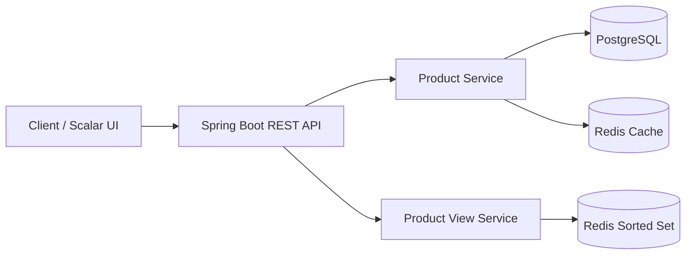

# Product Availability Service

A production-oriented REST API for managing product availability, stock levels, and product popularity.

The project was built as a focused backend service to demonstrate practical patterns with **Java 21**, **Spring Boot**, **PostgreSQL**, **Redis**, **Flyway**, **Testcontainers**, **Docker**, and automated CI.

PostgreSQL acts as the **source of truth**, while Redis is used for both **read caching** and **view-based trending rankings**.

---

## Features

- Create products with SKU, category, price, and initial stock
- Retrieve products by SKU
- List all products sorted alphabetically by name
- Update product stock
- Derive product availability from stock quantity
- Cache product lookups in Redis with a 5-minute TTL
- Invalidate cached product data after stock updates
- Track product views using a Redis Sorted Set
- Retrieve the top 10 trending products
- Version the database schema with Flyway
- Document the API with OpenAPI and Scalar
- Monitor application health with Spring Boot Actuator
- Run unit, integration, and HTTP integration tests
- Use real PostgreSQL and Redis instances in tests with Testcontainers
- Enforce coverage thresholds with JaCoCo
- Build with a multi-stage Dockerfile
- Run the full local environment with Docker Compose
- Validate builds automatically with GitHub Actions

---

## Architecture



### Data responsibilities

| Component | Responsibility |
| --- | --- |
| PostgreSQL | Source of truth for product data and stock |
| Redis Cache | Cached product lookup by SKU |
| Redis Sorted Set | Product view counters and trending ranking |
| Spring Cache | Cache abstraction for lookup and invalidation |

---

## Tech Stack

| Technology | Purpose |
| --- | --- |
| Java 21 | Application language |
| Spring Boot | Application framework |
| Spring Web MVC | REST API |
| Spring Data JPA / Hibernate | Persistence and ORM |
| PostgreSQL 18 | Relational database |
| Flyway | Database migrations |
| Redis 8 | Cache and popularity ranking |
| Spring Cache | Cache abstraction |
| OpenAPI + Scalar | Interactive API documentation |
| Spring Boot Actuator | Health monitoring |
| JUnit 5 / AssertJ / Mockito | Testing |
| Testcontainers | Integration-test infrastructure |
| JaCoCo | Code coverage |
| Maven | Build and dependency management |
| Docker / Docker Compose | Containerization and local orchestration |
| GitHub Actions | Continuous Integration |

---

## API Endpoints

Base path:

```text
/api/v1/products
```

| Method | Endpoint | Description |
| --- | --- | --- |
| `POST` | `/api/v1/products` | Create a product |
| `GET` | `/api/v1/products` | List products alphabetically |
| `GET` | `/api/v1/products/{sku}` | Retrieve a product by SKU |
| `PATCH` | `/api/v1/products/{sku}/stock` | Replace the current stock quantity |
| `GET` | `/api/v1/products/trending` | Return up to 10 products ranked by views |

### Create a product

```http
POST /api/v1/products
```

```json
{
  "sku": "MON-34",
  "name": "Monitor Ultrawide 34",
  "category": "MONITORS",
  "priceInCents": 189990,
  "stockQuantity": 10
}
```

Possible responses:

- `201 Created`
- `400 Bad Request`
- `409 Conflict` when the SKU already exists

### Update stock

```http
PATCH /api/v1/products/MON-34/stock
```

```json
{
  "quantity": 25
}
```

`quantity` is an **absolute stock value**, not an increment. A quantity of `0` makes the product unavailable.

---

## Cache Strategy

Product lookup uses Spring Cache backed by Redis.

```text
GET /products/{sku}
        |
        v
   Redis Cache
    /       \
 HIT         MISS
  |            |
  |       PostgreSQL
  |            |
  |       Cache result
   \          /
      Response
```

Configuration:

- Cache name: `products`
- Cache key: product SKU
- TTL: **5 minutes**
- Null values are not cached
- Stock updates invalidate the affected product entry
- Redis cache writes/evictions are configured for immediate visibility

After a stock update, the next lookup reloads the latest value from PostgreSQL and caches it again.

---

## Trending Strategy

Views are stored separately from the product cache in a Redis Sorted Set:

```text
product:views
```

Example:

```text
MON-34      -> 42
MOUSE-G502  -> 28
SSD-1TB     -> 17
```

A successful product lookup increments its score, including requests served from the product cache.

---

## Database

PostgreSQL is the authoritative product store.

The `products` table includes:

| Column | Description |
| --- | --- |
| `id` | Generated primary key |
| `sku` | Unique product identifier |
| `name` | Product name |
| `category` | Product category |
| `price_in_cents` | Price stored as integer cents |
| `stock_quantity` | Current stock quantity |

Important constraints include unique SKU, positive price, and non-negative stock.

Database evolution is managed by **Flyway**. Hibernate validates the mapped schema rather than creating it.

---

## API Documentation

Interactive documentation is rendered with **Scalar** from the generated OpenAPI specification.

```text
http://localhost:8080/docs
```

Raw OpenAPI document:

```text
http://localhost:8080/v3/api-docs
```

---

## Health Monitoring

Spring Boot Actuator exposes:

```text
GET /actuator/health
```

The application container uses this endpoint as its Docker healthcheck. PostgreSQL and Redis also have dedicated container healthchecks.

---

## Running with Docker Compose

### Requirements

- Docker / Docker Desktop

Create `.env` from `.env.example`:

```env
DB_URL=jdbc:postgresql://postgres:5432/product_availability
DB_USERNAME=product_app
DB_PASSWORD=product_app
POSTGRES_DB=product_availability
REDIS_HOST=redis
REDIS_PORT=6379
```

Start the complete environment:

```bash
docker compose up --build
```

Services:

```text
Spring Boot   -> localhost:8080
PostgreSQL    -> localhost:5432
Redis         -> localhost:6379
```

Stop the environment:

```bash
docker compose down
```

---

## Running Locally

Start only the infrastructure:

```bash
docker compose up postgres redis -d
```

Windows:

```powershell
.\mvnw.cmd spring-boot:run
```

Linux/macOS:

```bash
./mvnw spring-boot:run
```

---

## Testing

The project contains three complementary test layers.

### Unit tests

Service/domain behavior is tested with mocked dependencies, including creation, duplicate SKU handling, product lookup, stock rules, listing, and trending behavior.

### Integration tests

Real PostgreSQL and Redis instances are started through **Testcontainers**. Tests cover:

- first lookup populating Redis
- subsequent lookup returning cached data
- stock update invalidating stale cache data
- reload and recache after eviction
- cache TTL
- Redis view counters
- trending ranking
- persistence behavior

### HTTP integration tests

`MockMvc` exercises the Spring MVC flow, including validation, exception handling, persistence, caching, stock updates, view registration, sorting, and trending responses.

Run the complete verification lifecycle:

Windows:

```powershell
.\mvnw.cmd clean verify
```

Linux/macOS:

```bash
./mvnw clean verify
```

---

## Code Coverage

Coverage is measured with **JaCoCo**.

Current coverage is approximately:

| Metric | Coverage |
| --- | ---: |
| Instructions | 96% |
| Lines | ~97% |
| Classes | 100% |

The build enforces:

```text
Line coverage   >= 90%
```

HTML report:

```text
target/site/jacoco/index.html
```

---

## Continuous Integration

GitHub Actions runs on pushes and pull requests targeting `main`.

Pipeline:

```text
Checkout
   |
   v
Java 21
   |
   v
Maven clean verify
   |
   +--> Unit tests
   +--> Integration tests / Testcontainers
   +--> JaCoCo coverage checks
   |
   v
Docker image build
```

The workflow validates compilation, tests, coverage thresholds, Testcontainers compatibility, and the Docker image build. The generated JaCoCo HTML report is published as a workflow artifact.

---

## Docker Image

The application uses a **multi-stage Docker build** with Java 21. Maven and the JDK remain in the build stage, while the final image contains only the runtime and application JAR. The application runs as a non-root user.

Build manually:

```bash
docker build -t product-availability-service .
```

---

## Error Handling

The API uses centralized exception handling.

Example:

```json
{
  "timestamp": "2026-09-01T12:00:00Z",
  "status": 404,
  "code": "PRODUCT_NOT_FOUND",
  "message": "Product with SKU MON-34 was not found"
}
```

| Scenario | HTTP Status |
| --- | --- |
| Invalid request | `400 Bad Request` |
| Product not found | `404 Not Found` |
| Duplicate SKU | `409 Conflict` |

---

## Engineering Decisions

### PostgreSQL as source of truth

Redis is intentionally not authoritative. Product and stock data remain persisted in PostgreSQL.

### Price stored in cents

`priceInCents` avoids floating-point precision issues for monetary values.

### Cache-aside lookup

The service reads Redis first, falls back to PostgreSQL on a cache miss, caches the response, and invalidates the entry when stock changes.

### Separate cache and popularity data

Caching and popularity ranking solve different problems and use separate Redis structures.

### Flyway owns schema evolution

JPA maps Java objects to the schema, while Flyway owns schema creation and evolution.

### Integration tests use real dependencies

Testcontainers exercises real PostgreSQL and Redis behavior instead of approximating database, serialization, TTL, and Sorted Set semantics with mocks.

---

## Project Structure

```text
src/
├── main/
│   ├── java/.../
│   │   ├── config/
│   │   ├── product/
│   │   │   ├── controller/
│   │   │   ├── dto/
│   │   │   ├── exceptions/
│   │   │   ├── mapper/
│   │   │   ├── model/
│   │   │   ├── repository/
│   │   │   └── service/
│   │   └── shared/
│   │       └── exception/
│   └── resources/
│       ├── db/migration/
│       └── application.properties
└── test/
    └── java/.../product/
        ├── integration/
        └── service/
```

---

## Scope

The service intentionally does **not** implement shopping carts, orders, payments, reservations, users, authentication, or multiple warehouses. Keeping the scope focused makes the infrastructure, caching, persistence, testing, and engineering decisions easier to evaluate.

---

## Author

**Vinícius Kuchnir**  
Software Developer
